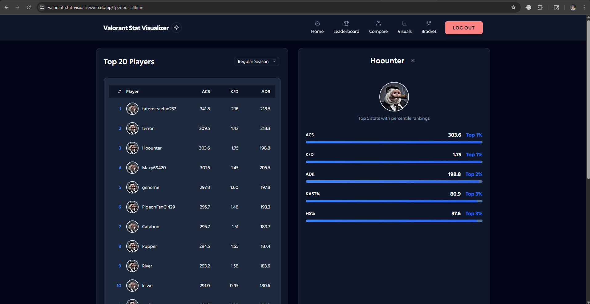
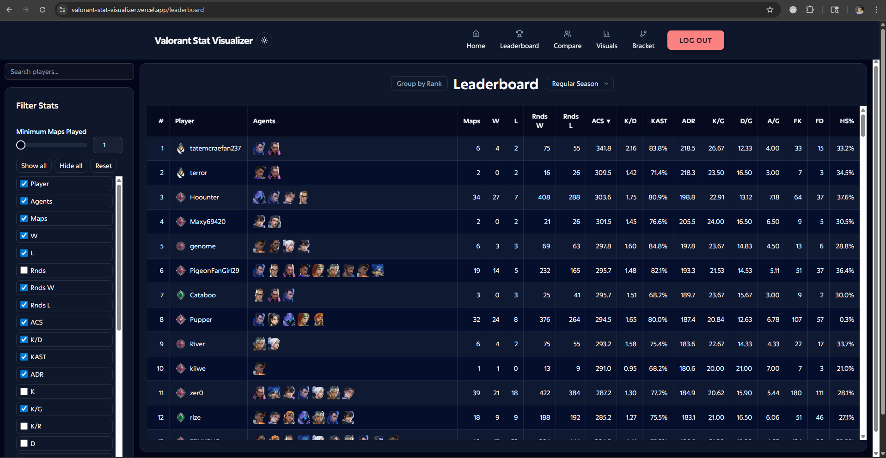
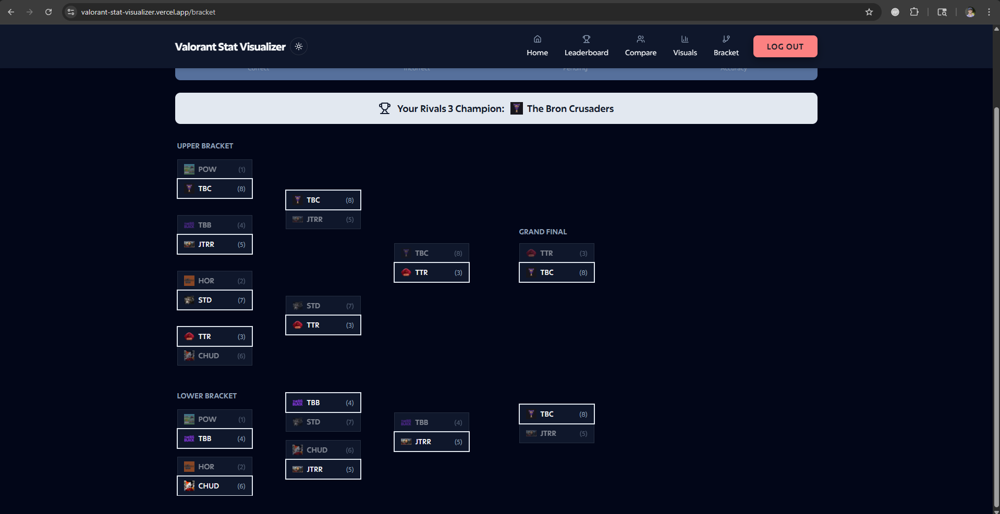
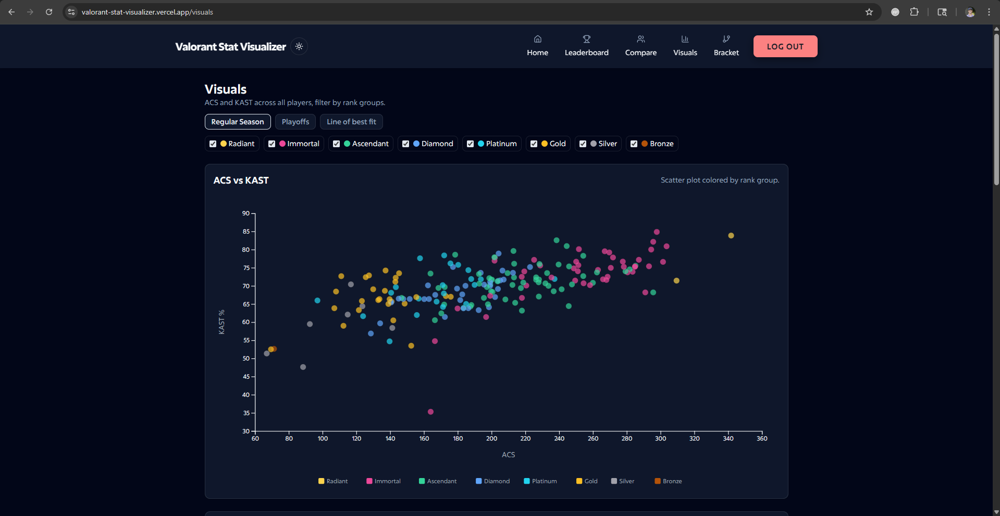

# Valorant Stat Visualizer

[](https://kit.svelte.dev)
[](https://www.typescriptlang.org)
[](https://tailwindcss.com)
[](https://d3js.org)
[](https://supabase.com)
[](https://postgresql.org)
[](https://vercel.com)

A full-stack esports analytics dashboard built for a private amateur Valorant league, featuring automated data ingestion, interactive visualizations, and tournament bracket predictions.

[View Live Demo](https://valorant-stat-visualizer.vercel.app)

---

## Screenshots

*Add screenshots here to showcase the dashboard:*

| Dashboard | Leaderboard | Bracket | Visuals |
|-----------|-------------|---------|---------|
|  |  |  |  |

---

## Features

- **Automated Data Pipeline** — Daily cron job ingests player statistics from Google Sheets, including color-based rank extraction from cell formatting
- **Interactive Leaderboard** — Sortable, filterable data table with percentile rankings and multi-column selection
- **Player Comparison Tool** — Side-by-side stat comparison with visual indicators and performance percentiles
- **D3.js Visualizations** — Scatterplots and line charts for performance trend analysis
- **Tournament Bracket Predictor** — Double-elimination bracket with Google OAuth authentication, prediction saving, live results comparison, and scoring system
- **Real-time Database** — PostgreSQL with Supabase for live stat updates and user bracket storage

---

## Tech Stack

| Category | Technologies |
|----------|--------------|
| **Frontend** | SvelteKit 5, TypeScript, Tailwind CSS 4, shadcn-svelte |
| **Visualization** | D3.js v7 |
| **Backend** | SvelteKit API routes, server-side rendering |
| **Database** | PostgreSQL 17 (Supabase), ~~Drizzle ORM~~ (deprecated - originally planned but not used) |
| **Authentication** | Supabase Auth with Google OAuth |
| **Data Pipeline** | Google Sheets API, Node.js cron jobs |
| **Deployment** | Vercel with automated deployments |
| **Testing** | Vitest, Playwright E2E |

---

## Architecture

```
Google Sheets (Weekly Stats)
         |
         v
Daily Cron Job (Vercel) --(REST API)--> Supabase PostgreSQL
         |                                      |
         v                                      v
  CSV Import CLI                     ~~Drizzle ORM Schema~~ (deprecated)
         |                                      |
         +------------> SvelteKit SSR <---------+
                              |
                              v
                    Client-side D3.js Charts
                              |
                              v
                    Tournament Bracket (Auth)
```

**Data Flow:**
1. **Ingestion**: Weekly stats from Google Sheets are imported via automated cron job or manual CSV CLI
2. **Processing**: Rank colors are extracted from spreadsheet cell formatting and mapped to Valorant tiers
3. **Storage**: PostgreSQL database with normalized schema (players, teams, stats, events, datasets)
4. **Serving**: SvelteKit server-side rendering with Supabase client for real-time queries
5. **Visualization**: D3.js renders interactive charts client-side for performance analysis

---

## Project Structure

```
├── src/
│   ├── routes/              # SvelteKit routes (pages + API)
│   │   ├── api/             # REST endpoints (import-sheets, leaderboard)
│   │   ├── bracket/         # Tournament bracket page
│   │   ├── compare/         # Player comparison page
│   │   ├── leaderboard/     # Full leaderboard page
│   │   └── visualizations/  # D3 charts page
│   ├── lib/
│   │   ├── components/      # Reusable Svelte components
│   │   ├── charts/          # D3 visualization components
│   │   ├── bracket_store/   # Bracket state management
│   │   ├── server/db/       # ~~Drizzle schema & DB client~~ (deprecated - Supabase client used instead)
│   │   └── assets/          # Agent icons, rank badges, team logos
│   └── hooks.server.ts      # Auth middleware & route guards
├── scripts/                 # CSV import CLI tool
├── drizzle/                 # ~~Database migrations~~ (deprecated - Drizzle not used)
├── supabase/                # Supabase configuration
└── vercel.json              # Deployment & cron configuration
```

---

## Getting Started

<details>
<summary>Click to expand setup instructions</summary>

### Prerequisites

- Node.js 18+
- PostgreSQL database (Supabase recommended)
- Google Cloud project (for Sheets API, optional)

### 1. Clone the repository

```bash
git clone https://github.com/hjwebb01/valorant-stat-visualizer.git
cd valorant-stat-visualizer
```

### 2. Install dependencies

```bash
npm install
```

### 3. Set up environment variables

Create a `.env` file in the project root:

```env
DATABASE_URL="postgresql://postgres:<password>@<project>.pooler.supabase.com:6543/postgres?sslmode=require"
SUPABASE_URL="https://<project>.supabase.co"
SUPABASE_ANON_KEY="<your-anon-key>"
SUPABASE_SERVICE_ROLE_KEY="<your-service-role-key>"
GOOGLE_CLIENT_ID="<google-oauth-client-id>"
GOOGLE_CLIENT_SECRET="<google-oauth-client-secret>"
SENTRY_DSN="<optional-sentry-dsn>"
```

For Supabase SSL certificate (if needed):

```bash
# Download your Supabase SSL certificate and place it at:
# ./supabase-ca.crt

# Windows PowerShell:
$env:NODE_EXTRA_CA_CERTS = "PATH\valorant-stat-visualizer\supabase-ca.crt"
```

### 4. Import data

**Google Sheets Import API** (`POST /api/import-sheets`)

The app includes a custom-built data ingestion API that connects directly to Google Sheets, extracts player statistics, and populates the database. This handles:

- **Multi-tab parsing** — Reads weekly stats tabs (e.g., `W1 Stats`, `W2 Stats`) and an all-time summary tab
- **Smart header normalization** — Maps 20+ spreadsheet column variations to standardized database fields
- **Rank extraction** — Extracts player rank tiers by reading cell background colors from the all-time sheet and mapping hex codes to Valorant ranks (Bronze → Radiant)
- **Team resolution** — Links players to teams via many-to-many relationships
- **Upsert logic** — Prevents duplicate entries while updating existing stats

Trigger locally:

```bash
curl -X POST http://localhost:5173/api/import-sheets
```

**Prerequisites**: Configure `GOOGLE_SERVICE_KEY_PATH`, `SHEET_ID_STATS`, and `SHEET_ID_TEAMS` in your `.env` file.

### 5. Run the development server

```bash
npm run dev
```

The app will be available at `http://localhost:5173`.

</details>

---

## Deployment

This project is configured for deployment on Vercel with the following features:

- **Automatic Deployments**: Triggered on every push to the main branch
- **Cron Jobs**: Daily data import at 6:00 AM UTC via `vercel.json` configuration
- **Environment Variables**: Configure all required env vars in Vercel dashboard

```bash
# Deploy manually (if needed)
npx vercel --prod
```

---

## License

MIT

---
